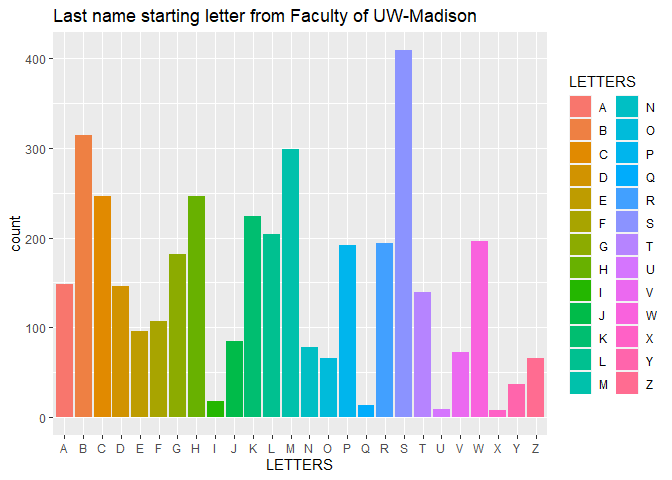
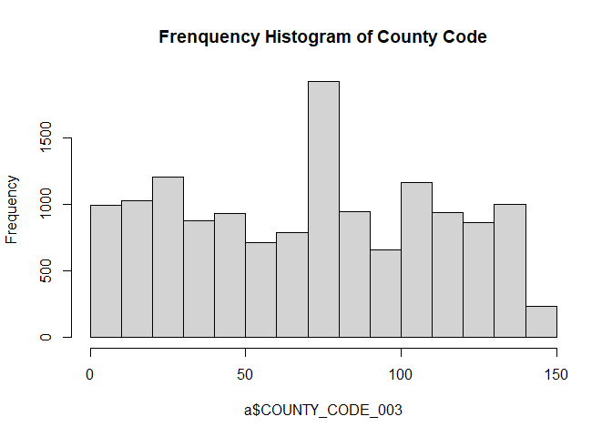

Hw1
================
Junghoon Kang
2021 9 17

``` r
library(readr)
library(rvest)
```

    ## 
    ## 다음의 패키지를 부착합니다: 'rvest'

    ## The following object is masked from 'package:readr':
    ## 
    ##     guess_encoding

``` r
library(readr)
library(ggplot2)
```

# UW Madison faculty data

## Data collecting

``` r
Faculty=read_html("https://guide.wisc.edu/faculty/")
pick1=html_nodes(Faculty,'.uw-people')

a<-c()
for (i in 1:26) {
a[i]<-sum(length(pick1[i] %>% html_nodes('p') %>% html_text()))
}
k=data.frame(LETTERS,count=a)
```

## Data visualization

``` r
ggplot(k,aes(x=LETTERS,y=count,fill=LETTERS))+
  geom_bar(stat="identity")+
  ggtitle("Last name starting letter from Faculty of UW-Madison")
```

<!-- -->

## Wisconsin bridge data

``` r
a=read.csv("WI20.csv", sep=",",quote = "",stringsAsFactors = FALSE)

hist(a$COUNTY_CODE_003,main = paste("Frenquency Histogram of County Code"))
```

<!-- -->
